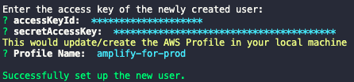

# Amplify Cross Account Using CodePipeline
 
This project was generated with:
 - [Angular CLI](https://github.com/angular/angular-cli) version 7.3.9.
 - [Amplify CLI](https://github.com/aws-amplify/amplify-cli) version 4.20.0.

The frontend is using Angular with amplify angular UI and themes. 

The backend is using Amplify with the following services:
- S3 as Storage.
- Cognito with custom confirmation link to register and confirm a new user (Lambda Trigger + S3VerificationBucket).
- S3 for hosting Angular Application.
  
Furthermore, it`s using cross account simulating two AWS accounts: developer and production.
- Developer AWS Account is related to dev/test branches.
- Production AWS Account is related to master branch.

## Diagram - Big Picture


## Before you begin to run this application

1. Install all the necessary tools:
   - Install [Node.JS](https://nodejs.org/en/download/).
   - Install [NPM](https://www.npmjs.com/get-npm).
   - Install [Amplify CLI](https://docs.amplify.aws/cli/start/install).
   - Install [AWS CLI V2](https://docs.aws.amazon.com/pt_br/cli/latest/userguide/cli-chap-install.html).

2. Fork|clone this repository.
    - For just development server, clone it.
    - For the CI/CD process, fork it.

## Setup AWS Profile

Create **two** IAM Users:
    - One simulating Developer/Test AWS Account.
    - Another simulating Production AWS Account.


1. Run in your terminal `amplify configure`.
2. Once you’re signed in, go to terminal and `Press Enter` and follow the commands:
   1. Specify the AWS region.
   2. Specify the username of IAM user.
3. Click in the link and register a new IAM user.
4. Create a user with **AdministratorAccess** to your account to provision AWS resources for you like AppSync, Cognito etc.
5. Once the user is created, Amplify CLI requests you to provide the **accessKeyId** and the **secretAccessKey** to connect Amplify CLI with your newly created IAM user.
6. Specify AWS Profile name for **amplify-for-dev-test**.

7. Sign out from AWS Console.
   
Sign in with **another** AWS Account. Repeat the process again to create a new IAM user. 

1. Specify AWS Profile name **amplify-for-prod**.


If you need more information, follow the [Amplify Documentation](https://docs.amplify.aws/start/getting-started/installation/q/integration/angular#option-1-watch-the-video-guide). 


UNTIL HERE DONE
UNTIL HERE DONE
UNTIL HERE DONE
UNTIL HERE DONE

UNTIL HERE DONEUNTIL HERE DONEUNTIL HERE DONEv
UNTIL HERE DONE


## Diagram - Amplify Environment


In the next steps, we are going to create all the amplify resources from the diagram above for each environment.

> :warning: Not recommended to label any service with sufix(dev, test, prod). Amplify already create sufix tags for each service added.!

### Creating Amplify Environment - Development

1. Run `npm install` to install all the packages needed.
2. Run `git checkout -b dev` to create the dev branch.
3. Run `amplify init` and follow the instructions according to your environment.
    
    - Amplify requests for an AWS Profile. (Answer Y, choose the dev/test AWS profile - **amplify-for-dev-test**).
    
4. Run `amplify add auth` to add Cognito. In order to use custom lambda trigger with cognito, follow the steps below:
    
5. Run `amplify add storage` to add s3 storage.

    - Choose `Content (Images, audio, video, etc.)`.
    - Provide a friendly name for your resource.
    - Provide a bucket name for your resource.
    - Grant permissions for your bucket.
    - Define if you want yo use lamda trigger for S3.
6. Run `amplify add hosting` to add hosting.

    - Choose `Amazon CloudFront and S3`.
    - Choose `DEV (S3 only with HTTP)`.
    - Create a hosting bucket name.
    - Choose the index location file of your app.
    - Choose the error location file of your app.
7. Run `amplify status` to see all the amplify resources status.
    
8. Run `amplify push` to push all the resources to the cloud through cloudformation.
    - CloudFormation creates one root stack and four nested stacks:

    - Creation of S3 as Storage
    - Creation of S3 as Hosting
    - Cognito User Pool
    - Lambda Trigger
9.  Run `amplify publish` to create the angular build and push to s3.
10. A link is going to the published. Click on it.

11. The screen below should appear in your browser:

12. Sign up a new user.
    - Check your email and confirm by clicking the url created by lambda.
    
    - Make sure your bucket have the right access.
13. Sign in.

ARRUMAR O FRONT-END NO STORAGE ARRUMAR O FRONT-END NO STORAGE ARRUMAR O FRONT-END NO STORAGE ARRUMAR O FRONT-END NO STORAGE ARRUMAR O FRONT-END NO STORAGE

### Creating Amplify Environment - Test 

1. Run `git checkout -b test` to create test branch.
2. Run `git merge dev` to merge **dev** branch to test.
3. Run `amplify init`.
    - Ask for use a existing environment. (Answer **N**)
    - Enter a name of the new amplify environment - (I choose **test**).
    - Amplify requests for an AWS Profile. - (Answer **Y**, choose the dev/test AWS profile - **amplify-for-dev-test**).
    - Since it was merged with dev branch, amplify requests only:
        - Configure a Lambda Trigger for Cognito - (Answer **Y**).
        - Choose **Custom Message** option and press **Space** and **Enter**.
        - Choose **Send Account Confirmation Link With Redirect**. 
        - Enter your URL for your website.
        - Enter the subject for your custom account confirmation email.
        - Enter the body text for your custom account confirmation email.
4. Run `amplify push` to push all the resources to the cloud.
5. Run `amplify publish` to create the angular build and push to s3.
6. A link is going to the published. Click on it.
    - If it runs with success, the screen below should appear in your browser:

7. Sign up a new User.
    - Check your email and confirm by clicking the url created by lambda.
    - Make sure your bucket have the right access.

### Creating Amplify Environment - Production 

1. Change your branch to master and merge the **test** branch.
    - Run `git checkout master`.
    - Run `git merge test`.
2. Run `amplify init`.
    - Ask for use a existing environment. (Answer **N**)
    - Enter a name of the new amplify environment - (I choose **prod**).
    - Amplify requests for an AWS Profile. - (Answer **Y**, choose the dev/test AWS profile - **amplify-for-prod**).

    - Since it was merged with **test** branch, amplify requests only:
        - Configure a Lambda Trigger for Cognito - (Answer **Y**).
        - Choose **Custom Message** option and press **Space** and **Enter**.
        - Choose **Send Account Confirmation Link With Redirect**. 
        - Enter your URL for your website.
        - Enter the subject for your custom account confirmation email.
        - Enter the body text for your custom account confirmation email.     
3. Run `amplify push` to push all the resources to the cloud.
4. Run `amplify publish` to create the angular build and push to s3.
5. A link is going to the published. Click on it.
    - If it runs with success, the screen below should appear in your browser:
    
6. Sign up a new User.
    - Check your email and confirm by clicking the url created by lambda.
    - Make sure your bucket have the right access.

## Diagram - Cross Account & CD


The next steps, it`s about the creation of the pipeline for continuous delivery and cross account setup.

### Pushing Golden Image to ECR 

> :warning: Use AWS CLI Latest Version.ˆ for `aws ecr` work as intended.

1. Sign in to AWS Console with your **development** AWS Account.
2. Access **ECR** Service and Create a repository in the ECR.
3. Click in the repository created, click **view push commands** and follow the **four** instructions.

4. Use this Dockerfile to build and push.
    - This dockerfile contains all the packages necessary to run the amplify build.
5. Inside the repository, click **Permissions**, **Edit policy JSON** and add the code below to grant CodeDeploy the right permissions.

```
{
  "Version": "2008-10-17",
  "Statement": [
    {
      "Sid": "CodeDeploy",
      "Effect": "Allow",
      "Principal": {
        "Service": "codebuild.amazonaws.com"
      },
      "Action": [
        "ecr:BatchGetImage",
        "ecr:GetDownloadUrlForLayer",
        "ecr:BatchCheckLayerAvailability"
      ]
    }
  ]
}
```

### Creating SSM Parameter Store Keys/Values

1. Store your Amplify Environment name for development and test and production via AWS CLI Or AWS Console.
    - You can always check your amplify env name with `amplify env list`

    - Using AWS CLI, execute the commands below:
  ```
  aws ssm put-parameter --name "amplifyEnvDev" --type "String" --value "dev"
  aws ssm put-parameter --name "amplifyEnvTest" --type "String" --value "test"
  aws ssm put-parameter --name "amplifyEnvProd" --type "String" --value "prod"
  ```

**For developer/test environment:**

1. Store your Access Key/Secret Key for **amplify-for-dev-test** into SSM Parameter Store via AWS CLI Or AWS Console.
    - Command using CLI: 
```
aws ssm put-parameter --name "access-key-amplify-dev-test" --type "SecureString" --value "YourAccessKey"
aws ssm put-parameter --name "secret-key-amplify-dev-test" --type "SecureString" --value "YourSecretKey"

```
    - Replace **YourAccessKey** for your Access Key.
    - Replace **YourSecretKey** for your Secret Key.
    - Do not forget to use `SecureString` to leverage best security practices.

2. Edit buildspec-dev.yml | env > parameter-store with your keys created.
```
env:
  parameter-store:
    ACCESS_KEY: "access-key-amplify-dev-test"
    SECRET_KEY: "secret-key-amplify-dev-test"
    ENV_AMPLIFY: "amplifyEnvDev"
```

3. Edit buildspec-test.yml | env > parameter-store with your keys created.
```
env:
  parameter-store:
    ACCESS_KEY: "access-key-amplify-dev-test"
    SECRET_KEY: "secret-key-amplify-dev-test"
    ENV_AMPLIFY: "amplifyEnvTest"
```
If you change any of the **buildspec-files**, commit and push. 

**For production environment:**

1. Sign in your AWS **Production** Account via AWS Console.
    - Access **IAM** and save your AWS Account ID at the bottom left.
2. Sign out and sign in with **Developer/Test** AWS Account.
3. Store **Production AWS account ID**  using SSM Parameter Store via AWS CLI OR AWS Console.
    - Command using CLI: `aws ssm put-parameter --name "AmplifyAccountNumberProd" --type "String" --value "YourAWSAccountID"`
    - Replace **YourAWSAccountID** for your AWS Account ID.
4. Edit buildspec-prod.yml | env > parameter-store with your keys created.
```
env:
  parameter-store:
    AMPLIFY_ACCOUNT_NUMBER_PROD: "AmplifyAccountNumberProd"
    ENV: "amplifyEnvProd"
```
5. Edit your buildspec-prod.yml referencing your environment variables from SSM.

If you change any of the **buildspec-files**, commit and push. 

### Creating build with CodeBuild with ECR 

1. Sign in your AWS **Dev/Test** Account via AWS Console.
2. Access **Codebuild** service and create **three** CodeBuild projects using your repository.
3. In **Source Version**, references your branch from git:
    - dev - Referencing dev branch.
    - test - Referencing test branch.
    - master - Referencing master branch.
4. In **Environment**: 
   1. Select **Custom Image** with **Linux** as Environment Type.
   2. Select **Amazon ECR** as Image registry.
   3. Select **My ECR account** 
   4. Select ECR repository created using the latest image.
    
5. In **buildspec** configuration:
    - Use the **buildspec-dev.yml** for Amplify Development Environment.
    - Use the **buildspec-test.yml** for Amplify Test Environment.
    - Use the **buildspec-prod.yml** for Amplify Production Environment.
6. Click **Create Build Project**.

**Grant Permission for each role created by codebuild**

1. Grant the right permissions for both CodeBuild roles have access to SSM.

```
{
    "Version": "2012-10-17",
    "Statement": [
        {
            "Effect": "Allow",
            "Action": [
                "ssm:Describe*",
                "ssm:Get*",
                "ssm:List*"
            ],
            "Resource": "*"
        }
    ]
}
```

2. Start the **development** build for testing purposes. 

If it runs with success, now it is time to create the production build.

### Cross Account Role - Configuring the production build permissions

1. Sign in to Production Account via AWS Console.
    - Create a IAM role with the right permissions to allow amplify create resources.
2. Grant trust relationship using AWS Dev Acccount ID.
    - Inside the role created.
    - Click `Trust relationship`.
    - Click `Edit trust relationship`.
    - Use Dev AWS Account ID in the code below.
```
{
  "Version": "2012-10-17",
  "Statement": [
    {
      "Effect": "Allow",
      "Principal": {
        "AWS": "arn:aws:iam::<AccountIDFromDevAcc>:root"
      },
      "Action": "sts:AssumeRole",
      "Condition": {}
    }
  ]
}
```

3. In **Developer Account** via AWS Console.
    - Go to your codebuild and access the Production build project.
    - Go to `Build details` and click in the `Service role` link.
    - It`s going to open the IAM role associated with Production Build.
    - Attach the code below:
```
{
    "Version": "2012-10-17",
    "Statement": [
        {
            "Effect": "Allow",
            "Action": "sts:AssumeRole",
            "Resource": "arn:aws:iam::<AccountIdProd>:role/CrossAccountRole"
        }
    ]
}
```
    - Change `<AccountIdProd>` to the AWS account ID from Production User Account.
    - Change `CrossAccountRole` to the role name created at the beginning of this section.

// TODO

CHANGE THE ROLE NAME FROM build-spec prod.yml

4. Start the **production** build.

If everything worked well, it is time to create the Pipeline.

### Create a Pipeline using AWS CodePipeline

For **development** pipeline:

1. Go to AWS CodePipeline Service and create a pipeline.
    - Enter the pipeline name.
    - Use your source provider and access your repository.
    - Use `dev` branch
    - For build stage, use `AWS CodeBuild` and use your codebuild `developer` environment.

2. Edit this pipeline
    - Click `Edit stage` in Edit:Source.
    - Click `Add Action` Button.
    - Add the ECR Image referencing the image that was created.
    - Click `Done`.
    - Save it.

For **test** pipeline:

1. Go to AWS CodePipeline Service and create a pipeline.
    - Enter the pipeline name.
    - Use your source provider and access your repository.
    - Use `test` branch
    - For build stage, use `AWS CodeBuild` and use your codebuild `test` environment.

2. Edit this pipeline
    - Click `Edit stage` in Edit:Source.
    - Click `Add Action` Button.
    - Add the ECR Image referencing the image that was created.
    - Click `Done`.
    - Save it.

For **production** pipeline:

1. Go to AWS CodePipeline Service and create a pipeline:
    - Enter the pipeline name.
    - Use your source provider and access your repository.
    - Use `master` branch.
    - For build stage, use `AWS CodeBuild` and use your codebuild `production` environment.

2. Edit this pipeline:
    - Click `Edit stage` in Edit:Source.
    - Click `Add Action` Button.
    - Add the ECR Image referencing the image that was created.
    - Click `Done`.
    - Save it.

The pipeline should have two sources.


## Setup CloudFront for Production Environment

1. In your AWS Production Account, open Cloudfront Service and create `Web Distribution`.
2. Point the `Origin Domain Name` to your s3 hosting bucket.
3. Set `true` to `Restrict Bucket Access`.
4. Set `Create a New Identity` to `true`.
5. Set `Yes, Update Bucket Policy` to `Grant Read Permissions on Bucket` and save it.
6. Go to your cloudfront created and click `Error Pages`, `Create Custom Error Response`.
7. Follow the steps as the image below:


Setup your bucket policy on your s3 bucket hosting.

1. Access your s3 bucket and edit bucket policy for:
```
{
    "Version": "2008-10-17",
    "Id": "PolicyForCloudFrontPrivateContent",
    "Statement": [
        {
            "Sid": "1",
            "Effect": "Allow",
            "Principal": {
                "AWS": "arn:aws:iam::cloudfront:user/CloudFront Origin Access Identity <yourOAIFromCloudFront>"
            },
            "Action": [
                "s3:GetObject",
                "s3:ListBucket"
            ],
            "Resource": [
                "arn:aws:s3:::yours3bucket/*",
                "arn:aws:s3:::yours3bucket"
            ]
        }
    ]
}
```

2. Open your cloudfront DNS at your browser!

## Issues

**Custom Message - ENV Variables**

- If you want to change the Environment Variables from lambda custom message authentication:
    - Change directly from console.
    

**Returning to amplify configuration from the cloud**

For some reason, you changed amplify configuration and want to return to the same configuration in the cloud.
- To return back to the same amplify configuration as in the cloud.
    - Run `amplify pull`, it`ll return to the original state.

****


## Cleaning Up all Your Resources

1. Run `amplify delete` for deleting all amplify environment
2. Access Amplify Console and delete the project.
3. Delete all the s3 buckets related to amplify manually.
4. Delete all the codebuild projects.
5. Disable and delete the CloudFront Distribution.

###Destroy The Service###

## Acknowledgments

- [AWS Profile](https://docs.amplify.aws/start/getting-started/installation/q/integration/angular#option-1-watch-the-video-guide)
- [ECR with CodeBuild](https://docs.aws.amazon.com/codebuild/latest/userguide/sample-ecr.html)
- [Build specification reference for CodeBuild](https://docs.aws.amazon.com/codebuild/latest/userguide/build-spec-ref.html)
- [Amplify UI Components](https://docs.amplify.aws/ui/q/framework/angular)


To be updated with latest amplify releases, always check:

- [Amplify CLI](https://github.com/aws-amplify/amplify-console)  
- [Amplify Documentation](https://docs.amplify.aws/lib/auth/start/q/platform/js)
